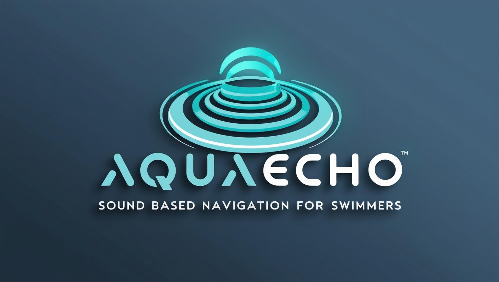

# AquaEcho - Smart Swimming Assistant



AquaEcho is a revolutionary iOS application designed to assist visually impaired and competitive swimmers with real-time lane guidance using haptic feedback and spatial audio cues.

## 🌟 Key Features

- **Real-time Lane Guidance**
  - Spatial audio feedback for lane position
  - Haptic alerts for drift correction
  - Turn detection and lap counting

- **Accessibility First**
  - Designed for visually impaired swimmers
  - VoiceOver optimized interface
  - High contrast visual elements

- **Advanced Motion Tracking**
  - Precise lane position detection
  - Automatic turn recognition
  - Stroke analysis

- **Comprehensive Analytics**
  - Detailed session statistics
  - Progress tracking
  - Performance insights

## 🛠 Technical Architecture

### Architecture :

```
AquaEcho/
├── CODE_OF_CONDUCT.md
├── Contributing.md
├── LICENSE
├── README.md
├── AquaEcho.swiftpm/Sources/
│   ├── Authentication/
│   │   └── AuthenticationManager.swift
│   ├── Components/
│   │   ├── LanePositionView.swift
│   │   └── SessionStatsView.swift
│   ├── Config/
│   │   ├── AirPodsConfig.swift
│   │   ├── APIConfig.swift
│   │   ├── CloudConfig.swift
│   │   ├── DeviceConfig.swift
│   │   ├── SecurityConfig.swift
│   │   └── WatchConfig.swift
│   ├── Managers/
│   │   ├── DataEncryptionManager.swift
│   │   ├── DeviceSyncManager.swift
│   │   ├── KeyChainManager.swift
│   │   ├── SettingsManager.swift
│   │   └── SwimSessionManager.swift
│   ├── Models/
│   │   ├── SwimSession.swift
│   │   └── UserProfile.swift
│   ├── Views/
│   │   ├── AboutView.swift
│   │   ├── Achievements.swift
│   │   ├── AuthenticationView.swift
│   │   ├── CalibrationView.swift
│   │   ├── EditProfileView.swift
│   │   ├── GoalsView.swift
│   │   ├── PrivacyPolicyView.swift
│   │   ├── ProfileView.swift
│   │   ├── SessionDetailView.swift
│   │   ├── SettingsView.swift
│   │   ├── StatsView.swift
│   │   ├── SwimView.swift
│   │   └── TermsOfServiceView.swift
│   ├── AquaEchoApp.swift
│   ├── AudioFeedback.swift
│   ├── HapticFeedback.swift
│   ├── HealthKitManager.swift
│   ├── Info.plist
│   ├── LapDetection.swift
│   ├── MotionManager.swift
│   └── UI.swift
├── Package.resolved
└── Package.swift
```

### Device Integration

#### Apple Watch Integration
- **Required Capabilities**
  - Accelerometer
  - Gyroscope
  - Heart Rate Monitor
  
- **Data Sync**
  ```swift
  WCSession.default.transferUserInfo([
      "sessionId": UUID,
      "metrics": [String: Any],
      "timestamp": Date
  ])
  ```

#### AirPods Integration
- **Spatial Audio**
  - Head tracking enabled
  - Dynamic head tracking
  - Personalized spatial audio
  
- **Configuration**
  ```swift
  AVAudioSession.sharedInstance().setCategory(
      .playAndRecord,
      mode: .default,
      options: [.allowBluetoothA2DP, .mixWithOthers]
  )
  ```

### API Documentation

#### Base URL
```
https://api.aquaecho.com/v1
```

#### Authentication
```http
POST /auth/login
Content-Type: application/json

{
    "email": "user@example.com",
    "password": "secure_password"
}
```

#### Session Data
```http
GET /sessions/{sessionId}
Authorization: Bearer {token}
```

#### Analytics
```http
POST /analytics/session
Content-Type: application/json
Authorization: Bearer {token}

{
    "sessionId": "uuid",
    "duration": 1800,
    "distance": 1500,
    "laps": 60,
    "metrics": {
        "avgPace": 120,
        "heartRate": [/* array of readings */],
        "position": [/* array of readings */]
    }
}
```

### HealthKit Integration

```swift
let healthStore = HKHealthStore()
let types: Set<HKObjectType> = [
    HKObjectType.workoutType(),
    HKObjectType.quantityType(forIdentifier: .heartRate)!,
    HKObjectType.quantityType(forIdentifier: .distanceSwimming)!,
    HKObjectType.quantityType(forIdentifier: .swimmingStrokeCount)!
]

healthStore.requestAuthorization(toShare: types, read: types) { success, error in
    // Handle authorization
}
```

## 📱 Device Requirements

### iOS Device
- iOS 16.0 or later
- iPhone XS or newer
- Required capabilities:
  - CoreMotion
  - CoreHaptics
  - HealthKit
  - Bluetooth

### Apple Watch
- watchOS 9.0 or later
- Series 6 or newer
- Required capabilities:
  - Heart rate monitoring
  - Water lock
  - Accelerometer
  - Gyroscope

### AirPods
- AirPods Pro (1st or 2nd generation)
- AirPods Max
- Required features:
  - Spatial audio support
  - Head tracking
  - Personalized spatial audio

## 🔒 Privacy & Security

### Data Storage
- Local storage: CoreData
- Cloud sync: CloudKit
- Encryption: AES-256
- Biometric authentication

### HealthKit Data
- Heart rate
- Swimming distance
- Workout duration
- Calorie burn
- Stroke count

### Permissions Required
- HealthKit
- Motion & Fitness
- Bluetooth
- Background processing

## 💻 Development Setup

### Prerequisites
- Xcode 15.0+
- iOS 16.0+ SDK
- Swift 5.9+
- CocoaPods or Swift Package Manager

### Installation
1. Clone the repository
```bash
git clone https://github.com/AdityaSeth777/AquaEcho.git
```

2. Install dependencies
```bash
cd AquaEcho.swiftpm
swift package resolve
```

3. Open the project
```bash
xed .
```

### Configuration
1. Set up signing certificate
2. Configure HealthKit capabilities
3. Enable background modes
4. Set up CloudKit container

## 🤝 Support & Community

- Email Support: contact@adityaseth.in

## 📄 License

This project is licensed under the MIT License - see [LICENSE](LICENSE) for details.

---

*Note: This application is designed to assist swimmers but should not be relied upon as the sole means of navigation. Always follow proper pool safety guidelines and regulations.*